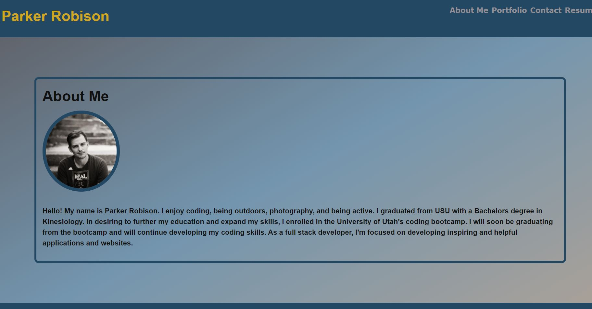

# re-portfolio

  

  ## Description 
  
  re-portfolio is a website for my personal protfolio and it is a single-page application (SPA) made using react. 
  
  
  ## Table of Contents
  
  * [Installation](#installation)
  * [Usage](#usage)
  * [Credits](#credits)
  * [License](#license)
  

  ## Installation
  
  No installation of the project is required. Visit https://parkerrobison.github.io/re-portfolio/ to view to the protfolio. 
  
  ## Usage 

  After navigating to the homepage of the porfolio. Click on the various 'tabs' in the navigation to see addtional information. Such as the an about me page, portfolio page, contact page, and a page to view my resume.
  
  ## Image
   
   
  ## License

  Apache
  

  ## Questions
  If you run into any errors or have further questions about this program, you can contact here: 
    *github: https://github.com/parkerrobison 
    *email: parkerobison@gmail.com.
  Please reference the project in question in the message. Thank you.

This project was bootstrapped with [Create React App](https://github.com/facebook/create-react-app).